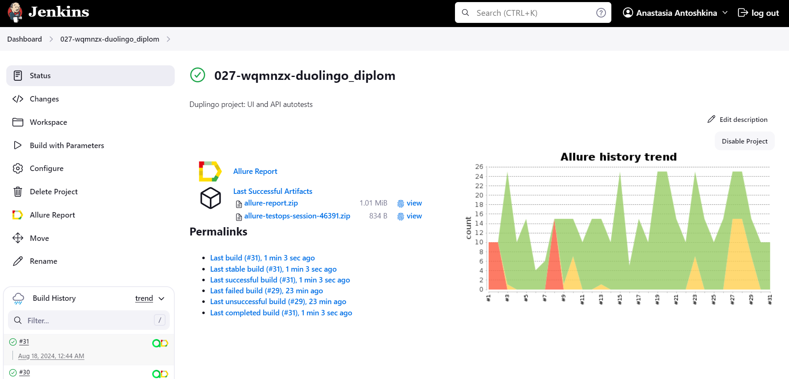
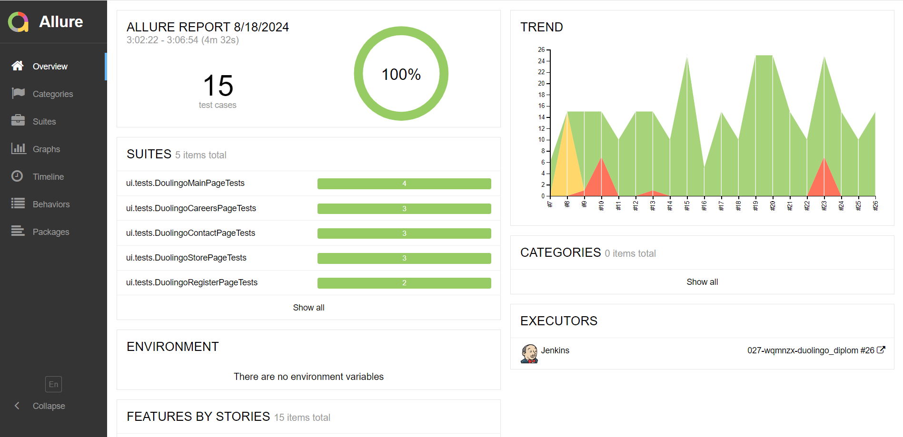
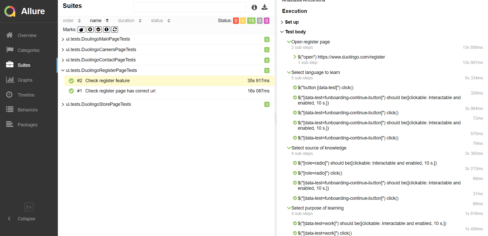
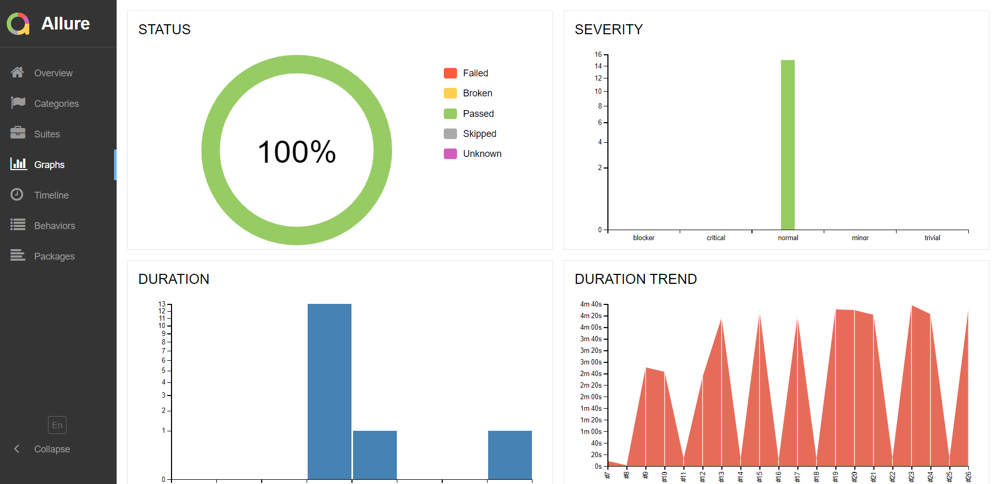
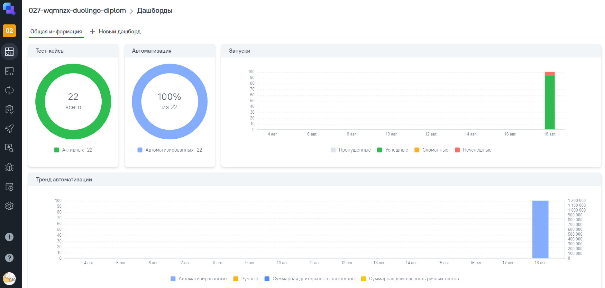
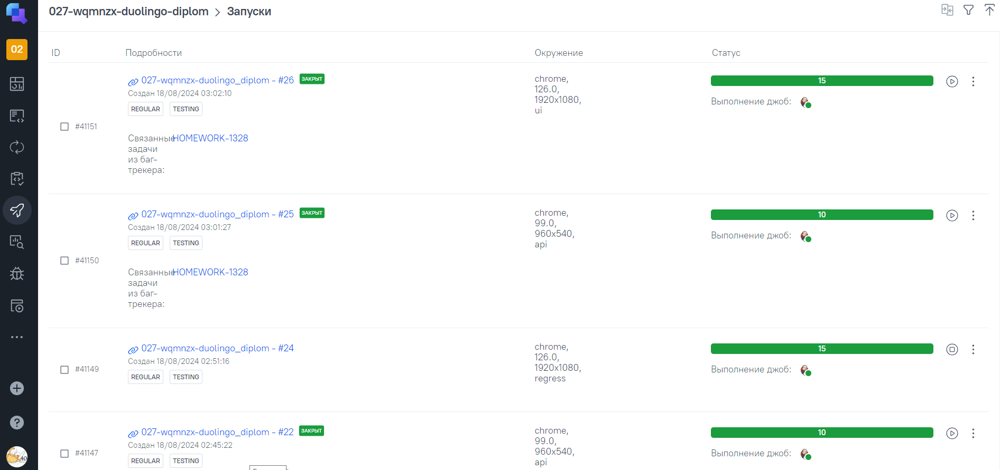
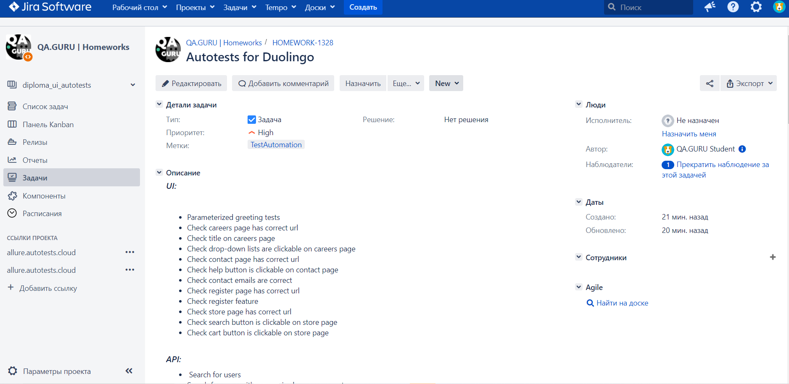
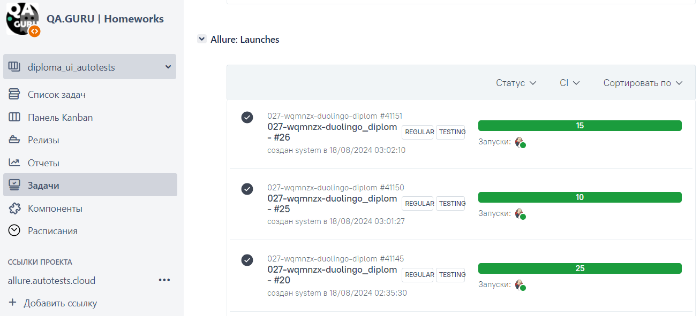
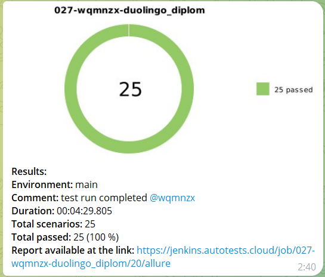
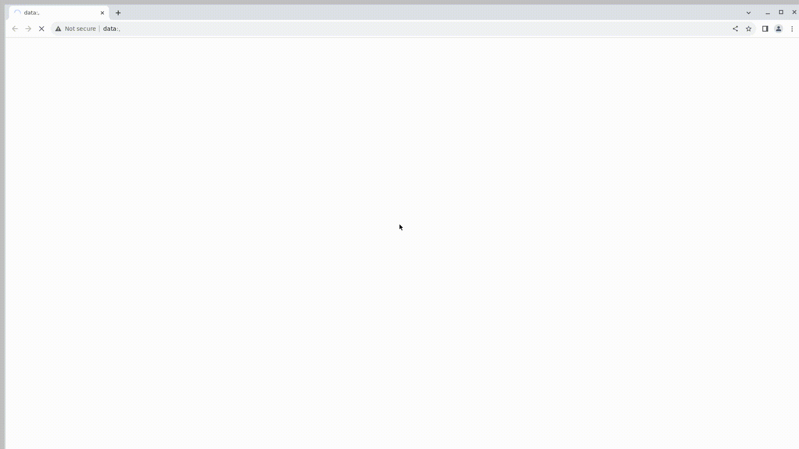

# Automation project for [Duolingo.com](https://www.duolingo.com/) [](https://www.duolingo.com/)
>With more than 500 million learners, Duolingo has the world's largest collection of language-learning data at its fingertips. This allows us to build unique systems, uncover new insights about the nature of language and learning, and apply existing theories at scales never before seen.

## :scroll: Table of contents
- [Technology stack](#computer-technology-stack)
- [Automated tests](#white_check_mark-automated-tests)
- [Jenkins build](#-jenkins-build)
- [Allure report](#-allure-report)
- [Allure TestOps](#-allure-testOps)
- [Jira](#-jira)
- [Telegram notifications](#-telegram-notifications)
- [Test execution in Selenoid](#-test-execution-in-selenoid)

## :computer: Technology stack
<p align="center">
<a href="https://www.jetbrains.com/idea/"></a> 
<a href="https://www.java.com/"></a>
<a href="https://selenide.org/"></a> 
<a href="https://aerokube.com/selenoid/"></a>
<a href="https://github.com/allure-framework/allure2"></a>
<a href="https://gradle.org/"></a> 
<a href="https://junit.org/junit5/"></a> 
<a href="https://rest-assured.io/"></a> 
<a href="https://qameta.io/"></a> 
<a href="https://github.com/"></a> 
<a href="https://www.jenkins.io/"></a>
<a href="https://telegram.org/"></a> 
<a href="https://www.atlassian.com/ru/software/jira"></a>
</p>

Automated tests:
- Implemented in ```Java``` language
- ```Gradle``` is used as a collector
- The frameworks used are ```JUnit 5``` and ```Selenide```
- When running remote tests, the browser starts in ```Selenoid```
- For making flexible tests ```Owner``` technology is used
- ```Faker``` is used to generate data
- ```Lombok``` is used for models in API tests
- ```Jenkins``` is used for remote launch
- Integration with ```Jira``` and ```Allure TestOps``` created
- ```Allure Report``` is generated for the build
- Sending ```Telegram``` notifications about results is configured


Based on results of passing autotests, an Allure report is generated. Contents of the report:
* Test steps
* Screenshot of the page at the last step
* Source code
* Browser console logs
* Test execution video

## :white_check_mark: Automated tests

### *UI:*
- Parameterized greeting tests
- Check careers page has correct url
- Check title on careers page
- Check drop-down lists are clickable on careers page
- Check contact page has correct url
- Check help button is clickable on contact page
- Check contact emails are correct
- Check register page has correct url
- Check register feature
- Check store page has correct url
- Check search button is clickable on store page
- Check cart button is clickable on store page

### *API:*
- Search for users
- Search for users with no required query parameter
- Get user profile
- Get user profile with invalid userId
- Subscribe to user
- Subscribe to user with invalid userId
- Enable dark mode
- Enable dark mode with invalid version number
- Set email reminder 
- Set email reminder with no body

##  [Jenkins build](https://jenkins.autotests.cloud/job/027-wqmnzx-duolingo_diplom/)
[]()

### *Jenkins build options:*
```TASK``` - task name (possible options - ```ui```, ```smoke```, ```regress``` for UI autotests; ```api```, ```profile```, ```settings```, ```positive```, ```negative``` for API autotests)
```BROWSER``` - browser for running UI autotests (default - ```chrome```)  
```BROWSER_VERSION``` - browser version for running UI autotests (default - ```126```)  
```BROWSE_SIZE``` - browser window size for running UI autotests (default - ```1920x1080```)
```TOKEN``` - the Bearer token to get access to Duolingo API

### *Launch commands*

***Locally/via Selenoid:***

To run all autotests (need to set Bearer token to get access to Duolingo API):
```bash
gradle clean test -Dtoken=''         
```
To run UI autotests remotely in <code>Selenoid</code> by default:
```bash
gradle clean ui
```
To run UI autotests on the local machine:
```bash
gradle clean ui -DisRemote=false
```
To run UI autotests with teg <code>smoke</code> (or <code>regress</code>) remotely in <code>Selenoid</code>:
```bash
gradle clean smoke
gradle clean regress
```
To run API autotests on the local machine:
```bash
gradle clean api -Dtoken=''
```
To run API autotests with teg <code>profile</code> (or <code>settings</code>/<code>positive</code>/<code>negative</code>) on the local machine:
```bash
gradle clean profile -Dtoken=''
gradle clean settings -Dtoken=''
gradle clean positive -Dtoken=''
gradle clean negative -Dtoken=''
```

***Via Jenkins:***
```bash
clean
${TASK}
-"Dbrowser=${BROWSER}"
-"DbrowserVersion=${BROWSER_VERSION}"
-"DbrowserSize=${BROWSER_SIZE}"
-"Dtoken=${TOKEN}"
```

To start the build:
1. Go to the build
2. Click on ```Build with parameters```
3. Select parameters
4. Click on ```Build```

##  [Allure report](https://jenkins.autotests.cloud/job/027-wqmnzx-duolingo_diplom/allure/)
After the build is completed the icons [](https://jenkins.autotests.cloud/job/027-wqmnzx-duolingo_diplom/allure/) and [](https://allure.autotests.cloud/project/4388/dashboards) are displayed in ```Build History```.
When clicking on the [](https://jenkins.autotests.cloud/job/027-wqmnzx-duolingo_diplom/allure/) icon, a page with a generated html report and test documentation opens. When clicking on the [](https://allure.autotests.cloud/project/4388/dashboards) icon the project page in Allure TestOps opens.
### *Main report page*
[](https://jenkins.autotests.cloud/job/027-wqmnzx-duolingo_diplom/allure/)

### *Test cases*
[](https://jenkins.autotests.cloud/job/027-wqmnzx-duolingo_diplom/allure/#suites)

### *Graphs*
[](https://jenkins.autotests.cloud/job/027-wqmnzx-duolingo_diplom/allure/#graph)

##  [Allure TestOps](https://allure.autotests.cloud/project/4388/dashboards)

```Allure TestOps``` is a test management platform that provides a comprehensive set of tools for organizing, executing, and analyzing tests in projects.

### *Dashboard*
Summary information about the current testing status of the project:
[](https://allure.autotests.cloud/project/4388/dashboards)

### *Launches*
This section displays test runs launched from Jenkins and Allure TestOps:
[](https://allure.autotests.cloud/project/4388/launches)

##  [Jira](https://jira.autotests.cloud/browse/HOMEWORK-1328)

Integration of Jira and Allure TestOps allows to link tasks and test documentation, which helps manage product quality effectively.
### *Jira task*
[](https://jira.autotests.cloud/browse/HOMEWORK-1328)

### *Allure: Launches*
[](https://jira.autotests.cloud/browse/HOMEWORK-1328)

##  Telegram notifications

After the build is completed, a special bot created in ```Telegram``` automatically processes and sends a message with a test run report.

[]()

##  Test execution in Selenoid

[]()
